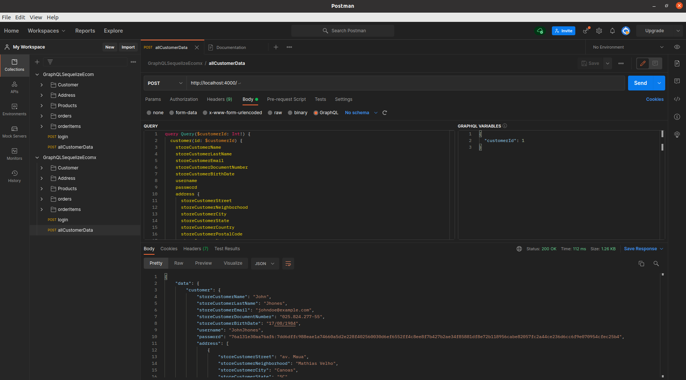

# GraphQLSequelizeEcom

# Habilidades

Nesse projeto, foi utilizado:

  - NodeJS
  - GraphQL
  - Sequelize
  - MySQL
  - Joi
  - Sqlite
  - Apollo Server
---

## O QUE FOI DESENVOLVIDO

Esta é Uma Api de E-commerce. Ela foi escrito em Node js, utilizando GraphQL com Apollo server e Sequelize ORM como principais dependências.

### Antes de começar:

1. Clone o repositório
  * `git clone git@github.com:CristianBrum/graphqlsequelizeecom.git`.

2. Instale as dependências e inicialize o projeto
  * Instale as dependências:
    * `npm run dev`
  * Inicialize o projeto:
    * `npm start`

3. Para rodar um container docker
  * Tenha docker e docker-compose instalado na sua maquina:
    * `docker-compose up `

  
  1. para acessar os emails enviados:
   * crie uma conta em [**ethereal**](https://ethereal.email/create).
   * copie o `user` e `password` do site.
   * atualize as variáveis de ambiente `NODEMAILER_USER` e `NODEMAILER_PASSWORD`.

4. Para Facilitar a manipulaçao das queries e mutation, recomendo importar o arquivo `postman_collection.json` no programa [**Postman**](https://www.postman.com/downloads/).

 * Clique em `import` na barra superior esquerda.
 *  selecione o arquivo dentro da pasta do projeto.
 
   
